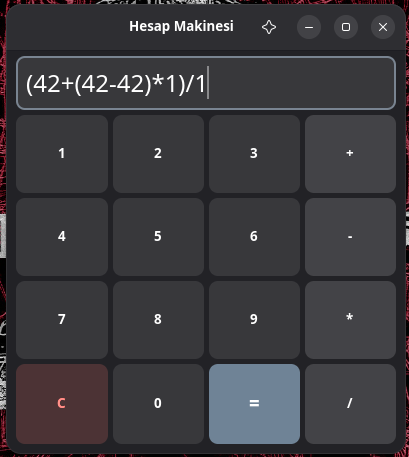

# Hesap Makinesi

This is a very basic calculator that can do 4 operations. I made this to learn libadwaita/gtk4.

# Features
+ All four arithmetic operations
+ Safe (I think so? I trust Rust.)
+ Parantese support

# Building
I love cargo.
+ `cargo run` or `cargo build --release`

It won't compile on Windows. It's very hard to compile GTK to Windows.

# LICENSE
This is under [MIT](LICENSE) license.
